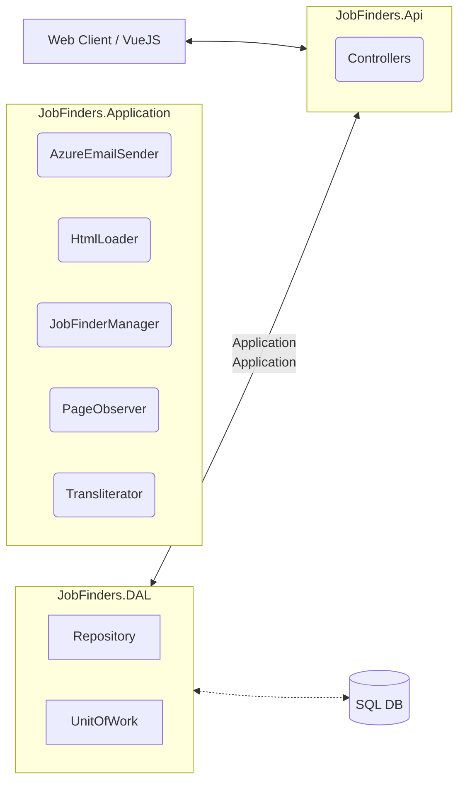

```mermaid
flowchart LR
  subgraph API[JobFinders.Api]
    Controllers(Controllers)
  end

  Client[Web Client / VueJS] <--> API

  subgraph Application[JobFinders.Application]
    direction LR
    AzureEmailSender(AzureEmailSender)
    HtmlLoader(HtmlLoader)
    JobFinderManager(JobFinderManager)    
    PageObserver(PageObserver)
    Transliterator(Transliterator)
  end

  subgraph DAL[JobFinders.DAL]
    direction LR
    Repository[Repository]
    UOW[UnitOfWork]
  end

  DAL <-- Application
  Application --> API

  DAL <-.-> DB[(SQL DB)]
```
