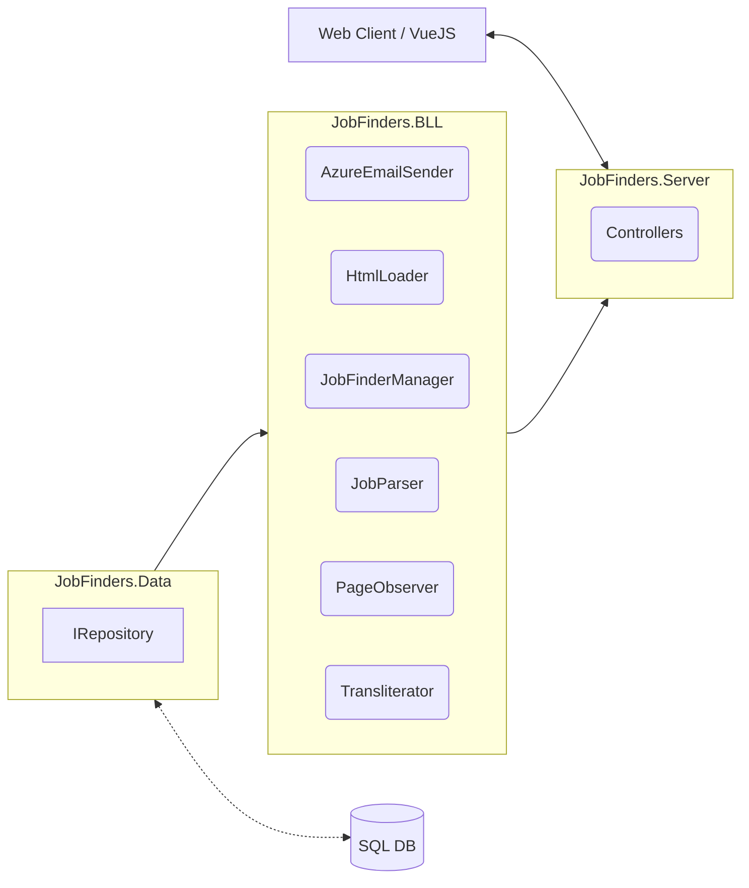

```mermaid
flowchart LR
  subgraph Server[JobFinders.Server]
    Controllers(Controllers)
  end

  Client[Web Client / VueJS] <--> Server

  subgraph BLL[JobFinders.BLL]
    direction LR
    AzureEmailSender(AzureEmailSender)
    HtmlLoader(HtmlLoader)
    JobFinderManager(JobFinderManager)
    JobParser(JobParser)
    PageObserver(PageObserver)
    Transliterator(Transliterator)
  end

  subgraph DATA[JobFinders.Data]
    IRepository[IRepository]
  end

  DATA --> BLL
  BLL --> Server

  DATA <-.-> DB[(SQL DB)]
```
